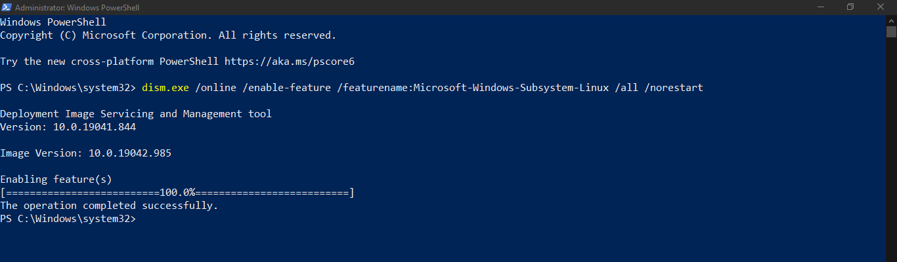
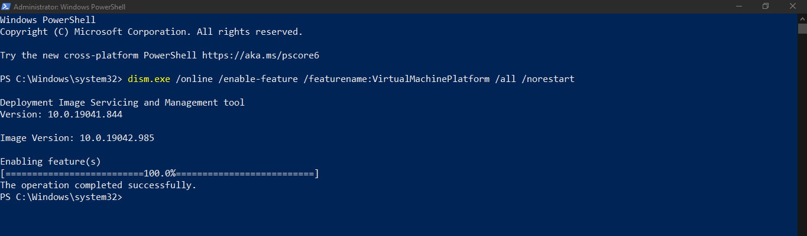
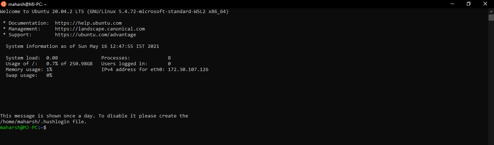

To Install Linux On Your Windows Machine, Here Are Some Requirements :-

   ###### Windows 10 Machine (Version 1903 or Higher)
   
   ###### Stable Internet Connection

First Of All You Need To Enable The Microsoft Linux Sub-System Feature On Your Machine
    
    dism.exe /online /enable-feature /featurename:Microsoft-Windows-Subsystem-Linux /all /norestart
        
Open Powershell From The Start Button And Run As Administrator  

  

Secondly Now You Need To Enable The Virtual Machine Platfrom On Your Machine
        
    dism.exe /online /enable-feature /featurename:VirtualMachinePlatform /all /norestart

And Now In That Powershell Windows You Need To Execute The Above Command
    
   

After That You Need To Install The WSL2 Linux Kernel From The Link Below

   [WSL Linux Kernal](https://wslstorestorage.blob.core.windows.net/wslblob/wsl_update_x64.msi)
    
Finally We Are Half Way There, This Is The Last Powershell Command You Have To Copy-Paste

    wsl --set-default-version 2

And Now We Are Finally Done, And Now You Can Install Any Linux Distro Available On The Microsoft Store And If Your Confused Then You Can Go With Any Ubuntu Version.
    
   - [Ubuntu 16.04 LTS](https://www.microsoft.com/store/apps/9pjn388hp8c9)
   - [Ubuntu 18.04 LTS](https://www.microsoft.com/store/apps/9N9TNGVNDL3Q)
   - [Ubuntu 20.04 LTS](https://www.microsoft.com/store/apps/9n6svws3rx71)
   - [openSUSE Leap 15.1](https://www.microsoft.com/store/apps/9NJFZK00FGKV)
   - [SUSE Linux Enterprise Server 12 SP5](https://www.microsoft.com/store/apps/9MZ3D1TRP8T1)
   - [SUSE Linux Enterprise Server 15 SP1](https://www.microsoft.com/store/apps/9PN498VPMF3Z)
   - [Kali Linux](https://www.microsoft.com/store/apps/9PKR34TNCV07)
   - [Debian GNU/Linux](https://www.microsoft.com/store/apps/9MSVKQC78PK6)
   - [Fedora Remix for WSL](https://www.microsoft.com/store/apps/9n6gdm4k2hnc)
   - [Pengwin](https://www.microsoft.com/store/apps/9NV1GV1PXZ6P)
   - [Pengwin Enterprise](https://www.microsoft.com/store/apps/9N8LP0X93VCP)
   - [Alpine WSL](https://www.microsoft.com/store/apps/9p804crf0395)
    
Now We Will Install Ubuntu From The Microsoft Store

    
    
After Installing And You Will Get This Window, It Will Prompt You With Username And Password And After That You Are Finally Done  

   
    
And After That Your Machine Is Ready And You Get Crazy With It, In The Next Blog I Might Show You How To Set-Up A Desktop Environment

   

    
   