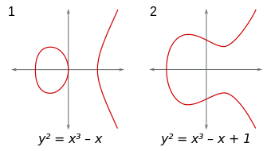

## Cryptocurrencies

So cryptocurrency is a form of payment that can be exchanged for goods and services, just like the money which is issued by the government also termed as fiat money. Think of it as you would as poker chips. You will need to exchange real currency, I.e Fiat Money, for the poker chips, I.e cryptocurrency to access the good or service, which here is to play poker.

These cryptocurrencies are decentralized which mean that there is no body which regulates it, like for example the cash that we have in our wallets are governed and regulated by the Reserve Bank of India, they have a lot of control on the Indian Rupee, on the other hand cryptocurrency exchange allows for direct peer-to-peer transfer to take place online securely and without the need for an intermediary, I.e RBI in our case

To name a few cryptocurrencies here is a list of the top 7 cryptocurrencies based on their price and market cap

|Currency  |Market Cap    |
|--------- |--------------|
|Bitcoin   |$735.3 billion|
|Ethereum  |$324.2 billion|
|Tether    |$61 billion   |
|Binance   |$57.5 billion | 
|Cardano   |$54.6 billion | 
|XRP 	   |$46.5 billion | 
|Dodge Coin|$45 billion   |

All cryptocurrencies are bases on blockchain technology, so essentially blockchain is most simply defined as a decentralized, distributed ledger that records the transactions, by the method of inheritance.

The whole point of using a blockchain is to let people — in particular, people who don't trust one another — share valuable data in a secure, tamperproof way — MIT Technology Review

A good analogy for blockchain is Google Docs. Google Docs is precisely how blockchain works. Of course, instead of it being a shared document, it’s a shared ledger that all involved parties have access to. Whatever changes within it can be verified by everyone in that network

A block chain is made of 3 things: - 

- Block: - Every chain consists of multiple blocks, there is a 32 bit whole number which is randomly generated when a block is created, which then generates a block header hash, The hash is a 256 bit number with the whole number and the data in the block is considered signed and forever tied to the whole number and hash

- Miners: - Miners create new blocks on the chain by mining. Every block has its own unique 32 bit whole number and a 265 bit hash, but also the hash of the previous block. special software is used to solve the math problem of finding a whole number which generated the right hash, there are approximately, four billion possible whole number from the hash, when they find the hash, then the block is added to the chain and the change is accepted by all nodes and the miner is rewarded with a small amount of that cryptocurrency, It is very difficult to change the block because the blocks ahead of it are dependent on it, if the block is manipulated then the chain breaks.

- Nodes: - Nobody owns the chain, It’s a distributed ledger system. Nodes are computers which maintains copies of the blockchain, Each and every node has its own copy of the blockchain and the network approves new mined block for the chain to be updated and verified. Every action in the ledger can be easily checked and viewed, each user of chain is given a unique alpha-numeric code which shows their transaction on the chain

If an faulty transaction is added to the chain the nodes connected to the main blockchain can verify that the transaction is a fraud because they all have an copy of the blockchain

Let me give you a small example,
 
 You give 10 BTC from your address 

*1KpW5zu4DpfbUtUWHfdWv1FjT95qhfgWXP* 
 To 
 *Bc1qwhqk05kygeexfjeletq75ea0434xnc*

For this transaction you need to know the private key of your account to make a valid digit signature on that transaction, and if you do not know your private key that you cannot make any transactions on your account, which makes the bitcoin unusable and not spendable

Private Key => Public Key => Hash => Wallet Address

|Elliptic Curve Algorithm |Bitcoin and Ethereum  |
|--|--|

Elliptic Curve can be generally denoted as :- y² = x³ + ax + b

Some Examples of Elliptic Curves are as follow :-

The Elliptic Curve used by Bitcoin is called “secp256k1” which is denoted as the following equation

- y² = x³ + 7

If you want to add 2 point on the curve you first need to find another point on the tangent line which joins the both 2 points, after that you reflect the point on the other X axis

If we take P as the referance point and add it to itself on an elliptical curve the sum of P+P=2P, but when we add P+P+P+P+P+P+P+P+P+P.....P which let's assume is 16P, it takes a lot of steps, this addition can be done much faster by the below formula

- nP + rP = (n+r)*P

After using the above formula, we can find out 10P with just 4 steps

- P + P = 2P
- 2P + 2P = 4P
- 4P + 4P = 8P
- 8P + 2P = 10P

Now think How much would it take to find out xP, where x ∈ Real Number and is a 256-bit integer, but interestingly it will never take more than 510 Addition Steps, Let me say why, at most x can contain up to X => X^225, Thus Step –2 Requires 255 Additional Steps, and in short to computer XP it will uttermost take 255+255 steps which is up to 510 Addition Steps

To Sum Up 
- *public key* = *private* *P*
- Here Private Key = 256-bit Integer 
- To generate the public key you compute using the above formula additionally putting in the parameters for the secp256k1 curve
- Nobody can track your public key back to your private key 
- After hashing the public key you get you wallet address

